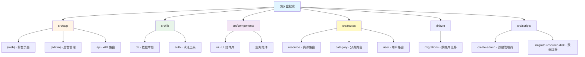

# 盘搜索 - AI 上下文文档

> **变更记录 (Changelog)**
> - **2025-11-21 14:31:35**: 初始化项目 AI 上下文文档，完成全仓扫描与架构梳理

---

## 项目愿景

盘搜索是一个一站式网盘资源搜索引擎，旨在为用户提供免费、快速、精准的网盘资源搜索服务。支持夸克网盘、百度网盘、阿里云盘等多个主流网盘平台，帮助用户轻松找到所需资源，实现一键直达。产品定位于安全无广告、简单好用的网盘搜索平台。

**在线体验**: https://pansousuo.top

---

## 架构总览

### 技术栈

- **前端框架**: Next.js 15 (App Router) + React 18
- **UI 组件**: Radix UI + Tailwind CSS (Shadcn/ui 风格)
- **状态管理**: React Hooks + Context API
- **表单处理**: React Hook Form + Zod (数据验证)
- **数据库**: MySQL + Drizzle ORM
- **API 层**: Hono (轻量级 Web 框架)
- **认证系统**: JWT (jose) + bcryptjs
- **PWA 支持**: next-pwa (支持离线访问)
- **代码规范**: Biome (格式化与 Lint)
- **包管理器**: pnpm 10.14.0
- **部署平台**: Zeabur, Vercel, Netlify

### 核心架构特点

1. **前后端一体化**: 使用 Next.js 的 Server Components、Server Actions 和 API Routes
2. **双布局系统**:
   - Web 端（普通用户）: 搜索引擎界面
   - Admin 端（管理员）: 后台管理系统
3. **数据库迁移管理**: 使用 Drizzle Kit 进行版本化数据库迁移（已有 15 个迁移文件）
4. **中间件保护**: Next.js 中间件实现路由级认证保护
5. **SEO 优化**: 完整的 metadata、sitemap、robots.txt、Open Graph 配置
6. **PWA 支持**: 支持添加到主屏幕、离线访问、Service Worker

---

## 模块结构图



---

## 模块索引

| 模块路径 | 职责描述 | 技术要点 |
|---------|---------|---------|
| **src/app** | 应用入口与页面路由 | Next.js 15 App Router，双布局（web/admin） |
| **src/lib** | 核心业务逻辑层 | 数据库操作、认证、工具函数 |
| **src/components** | React 组件库 | UI 组件（Shadcn/ui）+ 业务组件 |
| **src/routes** | API 路由定义 | Hono 框架，RESTful API 设计 |
| **src/middleware** | 中间件层 | JWT 认证、路由保护 |
| **drizzle** | 数据库迁移文件 | Drizzle ORM 版本化迁移（0000-0014） |
| **src/scripts** | 运维脚本 | 管理员创建、数据迁移工具 |
| **public** | 静态资源 | PWA 配置、图标、SEO 相关文件 |

---

## 运行与开发

### 环境准备

**必需环境**:
- Node.js 18+
- MySQL 数据库（或 PlanetScale）
- pnpm 10.14.0+

**环境变量配置** (`.env.local`):
```env
# 数据库配置
DATABASE_HOST=your-database-host
DATABASE_PORT=3306
DATABASE_USERNAME=your-username
DATABASE_PASSWORD=your-password
DATABASE_NAME=your-database-name

# JWT 密钥
JWT_SECRET=your-jwt-secret

# 可选：热门资源 API（用于首页推荐）
HOT_MOVIE_API=...
HOT_MOVIE_DAY_API=...

# 可选：生产环境分析
OPEN_PANEL_CLIENT_ID=...
```

### 常用命令

```bash
# 安装依赖
pnpm install

# 开发环境启动（支持 Turbopack）
pnpm dev

# 构建生产版本
pnpm build

# 启动生产服务器
pnpm start

# 代码检查
pnpm lint

# 代码格式化（Biome）
pnpm format

# 数据库相关
pnpm db:generate    # 生成数据库迁移文件
pnpm db:push        # 应用数据库迁移
pnpm db:studio      # 启动 Drizzle Studio（数据库 GUI）

# 运维脚本
pnpm create-admin             # 创建/更新管理员账户
pnpm migrate-resource-disk    # 迁移资源网盘数据
```

### 首次部署流程

1. 克隆仓库并安装依赖:
   ```bash
   git clone <repository-url>
   cd panxiaozi
   pnpm install
   ```

2. 配置环境变量（创建 `.env.local`）

3. 初始化数据库:
   ```bash
   pnpm db:push
   ```

4. 创建管理员账户:
   ```bash
   pnpm create-admin
   # 默认账号: admin@qq.com / test123
   ```

5. 启动开发服务器:
   ```bash
   pnpm dev
   ```

6. 访问服务:
   - 前台: http://localhost:3000
   - 后台: http://localhost:3000/admin/dashboard
   - 登录: http://localhost:3000/login

---

## 数据模型

### 核心表结构

#### category (分类表)
- `id`: 主键
- `name`: 分类名称
- `key`: 分类唯一标识（用于 URL）

#### resource (资源表)
- `id`: 主键
- `title`: 资源标题（带唯一索引）
- `categoryKey`: 关联分类
- `pinyin`: 拼音（用于 SEO 友好的 URL）
- `desc`: 资源描述
- `cover`: 封面图片 URL
- `diskType`: 网盘类型（百度/夸克/阿里等）
- `url`: 资源链接
- `hotNum`: 热度值（带索引，用于排序）
- `isShowHome`: 是否在首页展示
- `updatedAt`: 更新时间

#### user (用户表)
- `id`: 主键
- `username`: 用户名（管理员账号）
- `password`: 加密密码（bcrypt）
- `createdAt`: 创建时间

#### resource_disk (资源网盘关联表)
- `id`: 主键
- `resourceId`: 关联资源 ID（带索引）
- `diskType`: 网盘类型
- `externalUrl`: 外部资源 URL
- `url`: 内部转换后的 URL
- `updatedAt`: 更新时间

### 数据关系

```
category (1) -----> (*) resource
resource (1) -----> (*) resource_disk
```

---

## 测试策略

**当前状态**: 项目暂无独立测试文件（`*.test.ts` / `*.spec.ts`）

**推荐测试方向**:
1. **API 路由测试**:
   - 资源 CRUD 操作
   - 分类管理
   - 用户认证流程

2. **数据库查询测试**:
   - 关联查询性能
   - 搜索算法准确性（`getRelatedResources`）

3. **中间件测试**:
   - JWT 验证逻辑
   - 路由保护边界条件

4. **组件测试**:
   - 搜索表单提交
   - 分页组件逻辑
   - 管理后台表格操作

**建议工具栈**:
- 单元测试: Vitest + Testing Library
- E2E 测试: Playwright
- API 测试: Supertest

---

## 编码规范

### 代码风格
- **格式化工具**: Biome 1.9.4
- **缩进**: Tab (宽度 2)
- **引号**: 双引号
- **导入排序**: 自动化（Biome organizeImports）

### TypeScript 配置
- **目标版本**: ES2017
- **严格模式**: 启用
- **路径别名**: `@/*` 映射到 `./src/*`

### 组件设计原则
1. **Server Components 优先**: 默认使用 Server Components，仅在需要客户端交互时添加 `"use client"`
2. **组件拆分**:
   - `src/components/ui/`: 通用 UI 组件（Shadcn/ui）
   - `src/components/*.tsx`: 业务组件
3. **数据获取**: 在 Server Components 中直接调用数据库查询函数
4. **表单处理**: React Hook Form + Zod 验证

### 命名约定
- **文件名**: kebab-case（如 `search-form.tsx`）
- **组件名**: PascalCase（如 `SearchForm`）
- **函数名**: camelCase（如 `getResourceList`）
- **常量**: UPPER_SNAKE_CASE（如 `JWT_SECRET`）

### 数据库操作规范
- **查询函数位置**: `src/lib/db/queries/<domain>.ts`
- **Schema 定义**: `src/lib/db/schema.ts`（集中管理）
- **迁移管理**: 使用 Drizzle Kit 自动生成，不手动编辑迁移文件

---

## AI 使用指引

### 代码修改建议

**推荐操作**:
1. 添加新功能时，优先参考现有代码结构（如新增路由参考 `src/routes/*.ts`）
2. UI 组件优先使用 Shadcn/ui，避免引入新的 UI 库
3. 数据库修改必须通过 Drizzle 迁移，而非直接修改 SQL

**禁止操作**:
- 不要直接修改 `drizzle/` 下的迁移文件
- 不要绕过中间件直接访问 `/admin` 路由
- 不要在客户端组件中直接调用数据库查询

### 快速定位代码

| 需求 | 文件路径 |
|------|---------|
| 修改首页布局 | `src/app/(web)/page.tsx` |
| 添加新的 API 端点 | `src/routes/<domain>.ts` + 注册到 `src/app/api/[[...route]]/route.ts` |
| 修改数据表结构 | `src/lib/db/schema.ts` → 运行 `pnpm db:generate` |
| 调整认证逻辑 | `src/middleware.ts` / `src/middleware/auth.ts` |
| 添加新的管理页面 | `src/app/(admin)/admin/<page>/page.tsx` |
| 修改搜索算法 | `src/lib/db/queries/resource.ts` 中的 `getRelatedResources` 函数 |

### 常见问题排查

1. **数据库连接失败**:
   - 检查 `.env.local` 配置
   - 运行 `pnpm db:push` 确认连接

2. **登录失败**:
   - 确认管理员账户已创建（`pnpm create-admin`）
   - 检查 JWT_SECRET 是否配置

3. **构建报错**:
   - 运行 `pnpm format` 格式化代码
   - 检查 TypeScript 类型错误

4. **PWA 不生效**:
   - 确认 `NODE_ENV=production`
   - 检查 `public/manifest.json` 和图标资源

---

## 项目特色功能

### 1. 智能相关推荐
- **位置**: `src/lib/db/queries/resource.ts` → `getRelatedResources`
- **算法**:
  - 关键词提取（去除年份、季数、画质等冗余信息）
  - 多维度评分（关键词命中数 + 前缀加权 + 同类加权 + 热度/时间微调）
  - 同分类优先 + 跨分类补充策略

### 2. 热门资源聚合
- **位置**: `src/lib/db/queries/resource.ts` → `getHotResource`
- **策略**:
  - 优先从外部 API 获取热门影视数据
  - 降级方案：从数据库按热度排序获取
  - 使用 Next.js `unstable_cache` 缓存 30 分钟

### 3. SEO 优化
- **Metadata 管理**: `src/app/layout.tsx` 中配置完整的 Open Graph、Twitter Card
- **Sitemap 生成**: `src/app/sitemap.ts` 动态生成
- **友好 URL**: 使用拼音作为资源详情页路径（如 `/resource/zhe-yao-guai`）

### 4. PWA 离线支持
- **Service Worker**: 自动生成（`next-pwa`）
- **Manifest**: `/public/manifest.json`
- **离线页面**: `/app/offline/page.tsx`

---

## 部署与运维

### 推荐部署方案

1. **Zeabur** (推荐):
   - 一键部署，自动识别 Next.js 项目
   - 集成 MySQL 数据库
   - 环境变量配置简单
   - 参考: https://zeabur.com

2. **Vercel**:
   - 原生支持 Next.js
   - 需要外部数据库（推荐 PlanetScale）
   - 配置环境变量后即可部署

3. **Netlify**:
   - 使用 `netlify.toml` 配置构建
   - 需要配置外部数据库

### 环境变量管理

**生产环境必需**:
```env
DATABASE_HOST
DATABASE_USERNAME
DATABASE_PASSWORD
DATABASE_NAME
JWT_SECRET
```

**可选配置**:
```env
NODE_ENV=production
OPEN_PANEL_CLIENT_ID=<分析工具>
HOT_MOVIE_API=<热门资源 API>
```

### 数据库维护

1. **备份策略**:
   - 定期导出数据库（`mysqldump`）
   - 使用云数据库的自动备份功能

2. **迁移回滚**:
   ```bash
   # 查看迁移历史
   pnpm db:studio

   # 手动回滚（慎用）
   # 需要手动执行反向 SQL
   ```

3. **性能优化**:
   - 监控索引使用率（`hot_num`、`resource_id`）
   - 定期清理过期数据

---

## 相关资源

- **GitHub 仓库**: (待补充)
- **官方文档**:
  - Next.js: https://nextjs.org
  - Drizzle ORM: https://orm.drizzle.team
  - Hono: https://hono.dev
  - Shadcn/ui: https://ui.shadcn.com
- **在线演示**: https://pansousuo.top

---

## 后续优化建议

1. **测试覆盖**: 添加单元测试与 E2E 测试
2. **性能监控**: 接入 Sentry 或 LogRocket
3. **缓存优化**: 考虑引入 Redis 缓存热门搜索
4. **搜索增强**: 集成全文搜索引擎（Elasticsearch / Meilisearch）
5. **移动端优化**: 优化移动端搜索体验（当前已响应式，可进一步优化交互）
6. **多语言支持**: 添加 i18n 国际化
7. **API 文档**: 生成 OpenAPI/Swagger 文档
