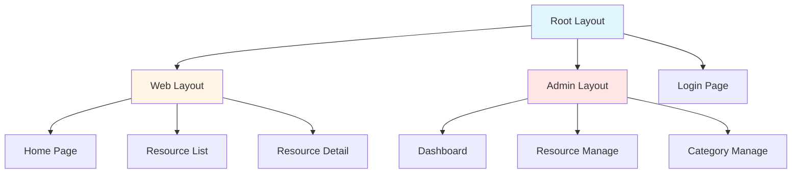
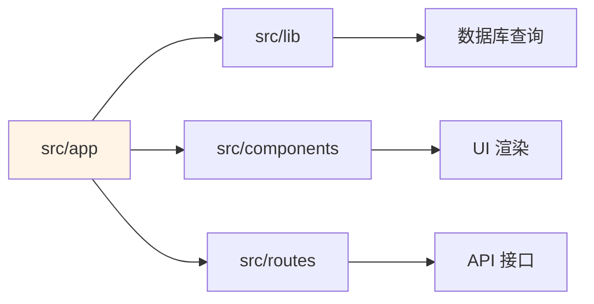

[根目录](../../CLAUDE.md) > **app (应用路由层)**

---

# app - 应用路由层

> **变更记录 (Changelog)**
> - **2025-11-21 14:31:35**: 初始化模块文档，梳理页面路由与布局结构

---

## 模块职责

`src/app` 是基于 **Next.js 15 App Router** 的应用路由层，负责：
1. **页面路由**: 定义 Web 端与 Admin 端的页面结构
2. **布局管理**: 提供嵌套布局系统（Root Layout、Web Layout、Admin Layout）
3. **数据获取**: 在 Server Components 中直接调用数据库查询
4. **SEO 优化**: 配置 Metadata、Sitemap、Robots.txt

---

## 入口与启动

### 根布局入口
- **文件**: `src/app/layout.tsx`
- **职责**:
  - 定义全局 HTML 结构
  - 配置 PWA Metadata
  - 加载全局样式与主题
  - 集成分析工具（Umami、OpenPanel）

**关键配置**:
```typescript
export const metadata: Metadata = {
  title: "盘搜索 - 免费网盘资源搜索引擎 | 一站式网盘搜索平台",
  description: "盘搜索为您提供免费的网盘资源搜索服务...",
  keywords: "盘搜索,网盘搜索,夸克网盘,百度网盘,阿里云盘...",
  robots: "index, follow",
  metadataBase: new URL("https://pansousuo.top"),
  openGraph: { ... },
  twitter: { ... },
  manifest: "/manifest.json",
};
```

---

## 对外接口

### 页面路由结构

```
src/app/
├── layout.tsx                  # 根布局
├── globals.css                 # 全局样式
├── not-found.tsx               # 404 页面
├── offline/page.tsx            # PWA 离线页面
├── login/page.tsx              # 登录页面
│
├── (web)/                      # 前台页面组
│   ├── layout.tsx              # Web 布局
│   ├── page.tsx                # 首页
│   ├── resource/
│   │   ├── page.tsx            # 资源列表页（搜索结果）
│   │   └── [name]/page.tsx     # 资源详情页（动态路由）
│   └── contact/page.tsx        # 联系页面
│
├── (admin)/                    # 后台管理组
│   ├── layout.tsx              # Admin 布局（带认证）
│   └── admin/
│       ├── dashboard/page.tsx  # 仪表盘
│       ├── resource/page.tsx   # 资源管理
│       └── category/page.tsx   # 分类管理
│
└── api/[[...route]]/route.ts   # API 路由入口
```

---

## 关键页面说明

### 1. 首页 (`src/app/(web)/page.tsx`)

**职责**: 展示搜索框与首页资源

**核心功能**:
- 展示 Hero 区域（搜索框）
- 显示精选资源列表（`isShowHome=1` 的资源）
- 支持 ISR（增量静态再生成，60 秒刷新）

**代码片段**:
```typescript
export const revalidate = 60; // 60秒缓存

export default function Home() {
  return (
    <>
      <Hero />
      <ResourceList />
    </>
  );
}
```

---

### 2. 搜索结果页 (`src/app/(web)/resource/page.tsx`)

**职责**: 展示搜索结果与分类筛选

**URL 示例**:
- `/resource?q=街舞`
- `/resource?category=zongyi`
- `/resource?q=街舞&category=zongyi&page=2`

**核心功能**:
- 关键词搜索（模糊匹配标题）
- 分类过滤
- 分页加载

---

### 3. 资源详情页 (`src/app/(web)/resource/[name]/page.tsx`)

**职责**: 展示单个资源的详细信息与关联推荐

**URL 示例**:
- `/resource/zhe-jiu-shi-jie-wu` (使用拼音作为 URL slug)

**核心功能**:
- 展示资源标题、描述、封面图
- 显示多网盘链接（支持一资源多网盘）
- 相关推荐资源列表（基于智能算法）

**数据获取**:
```typescript
const resource = await getResourceByPinyin(params.name);
const relatedResources = await getRelatedResources(
  resource.title,
  resource.categoryKey,
  resource.id
);
```

---

### 4. 管理后台 - 仪表盘 (`src/app/(admin)/admin/dashboard/page.tsx`)

**职责**: 展示数据统计与图表

**核心功能**:
- 资源总数、分类数、热度排行
- 图表展示（使用 Recharts）
- 近期更新资源列表

---

### 5. 管理后台 - 资源管理 (`src/app/(admin)/admin/resource/page.tsx`)

**职责**: 后台资源 CRUD 操作

**核心功能**:
- 资源列表展示（支持搜索与分类过滤）
- 新增/编辑资源表单
- 删除资源（带确认弹窗）
- 批量操作（可选）

---

### 6. 登录页 (`src/app/login/page.tsx`)

**职责**: 管理员登录

**核心功能**:
- 表单验证（React Hook Form + Zod）
- 登录成功后自动跳转到 `/admin/dashboard`
- 已登录用户访问自动重定向

---

## 关键依赖与配置

### 依赖包
```json
{
  "next": "^15.2.0",              // Next.js 框架
  "react": "^18.3.1",             // React 18
  "next-pwa": "^5.6.0",           // PWA 支持
  "next-themes": "^0.4.6",        // 主题切换
  "@openpanel/nextjs": "^1.0.8"  // 分析工具
}
```

### Next.js 配置 (`next.config.js`)

```javascript
const withPWA = require("next-pwa")({
  dest: "public",
  disable: process.env.NODE_ENV === "development",
  register: true,
  skipWaiting: true,
});

const nextConfig = {
  output: "standalone",           // 独立构建模式
  distDir: "out",                 // 输出目录
  images: {
    unoptimized: true,            // 禁用图片优化（部署兼容性）
    domains: ["source.unsplash.com", "images.unsplash.com"],
  },
};

module.exports = withPWA(nextConfig);
```

---

## 布局系统

### 嵌套布局结构



### 布局特性

**Web Layout** (`src/app/(web)/layout.tsx`):
- 不需要认证
- 包含全局导航栏、Footer
- 响应式设计（移动端适配）

**Admin Layout** (`src/app/(admin)/layout.tsx`):
- 需要认证（通过 `getCurrentUser()` 验证）
- 包含侧边栏（Sidebar）、顶部栏
- 使用 Shadcn/ui Sidebar 组件

---

## 中间件保护

### 路由级认证
- **文件**: `src/middleware.ts`
- **保护路径**: `/admin/*`

**逻辑**:
1. 检查 Cookie 中的 `admin-token`
2. 使用 `jose` 验证 JWT 令牌
3. 无效或不存在则重定向到 `/login`
4. 登录页检测到有效令牌则重定向到 `/admin/dashboard`

```typescript
export const config = {
  matcher: ["/admin/:path*", "/login"],
};
```

---

## SEO 优化

### 1. Sitemap 生成 (`src/app/sitemap.ts`)

**动态生成站点地图**:
```typescript
export default async function sitemap(): Promise<MetadataRoute.Sitemap> {
  const resources = await getAllResource();

  return [
    { url: "https://pansousuo.top", lastModified: new Date() },
    ...resources.map((r) => ({
      url: `https://pansousuo.top/resource/${r.pinyin}`,
      lastModified: r.updatedAt,
    })),
  ];
}
```

### 2. Metadata 配置

**根布局**:
- `title` / `description` / `keywords`
- Open Graph 标签（社交媒体分享优化）
- Twitter Card 配置
- Canonical URL

**页面级 Metadata**:
```typescript
export async function generateMetadata({ params }): Promise<Metadata> {
  const resource = await getResourceByPinyin(params.name);

  return {
    title: `${resource.title} - 盘搜索`,
    description: resource.desc,
    openGraph: {
      images: [resource.cover],
    },
  };
}
```

### 3. Robots.txt (`public/robots.txt`)

```txt
User-agent: *
Allow: /
Sitemap: https://pansousuo.top/sitemap.xml
```

---

## 测试与质量

**当前状态**: 无独立测试文件

**推荐测试用例**:
1. **页面渲染测试**:
   - 测试首页组件正确渲染
   - 测试搜索表单提交逻辑

2. **路由测试**:
   - 测试动态路由参数解析
   - 测试 404 页面展示

3. **认证流程测试**:
   - 测试未登录访问 `/admin` 重定向
   - 测试登录成功后的跳转逻辑

**建议工具**:
- E2E 测试: Playwright
- 组件测试: Testing Library + Vitest

---

## 常见问题 (FAQ)

### 1. 如何添加新页面？
**步骤**:
1. 在 `src/app/(web)` 或 `src/app/(admin)/admin` 下创建新文件夹
2. 添加 `page.tsx` 文件
3. 定义页面组件与 Metadata

**示例**:
```typescript
// src/app/(web)/about/page.tsx
export const metadata = {
  title: "关于我们 - 盘搜索",
};

export default function AboutPage() {
  return <div>关于页面内容</div>;
}
```

### 2. 如何在页面中调用 API？
**方法**:
- **Server Components**: 直接调用 `src/lib/db/queries/*` 函数
- **Client Components**: 使用 `fetch` 调用 `/api/*` 端点

**示例**:
```typescript
// Server Component
import { getResourceList } from "@/lib/db/queries/resource";

export default async function Page() {
  const data = await getResourceList();
  return <div>{data.list.map(...)}</div>;
}

// Client Component
"use client";
import { useEffect, useState } from "react";

export default function Page() {
  const [data, setData] = useState([]);

  useEffect(() => {
    fetch("/api/resource/list")
      .then((res) => res.json())
      .then(setData);
  }, []);

  return <div>{data.list?.map(...)}</div>;
}
```

### 3. 如何调试 Server Components？
**方法**:
- 使用 `console.log` 打印数据（输出在服务器终端，非浏览器控制台）
- 使用 React DevTools（仅 Client Components）
- 查看 Next.js 错误页面的堆栈信息

### 4. PWA 为什么不生效？
**排查步骤**:
1. 确认 `NODE_ENV=production`（开发环境禁用 PWA）
2. 检查 `public/manifest.json` 是否存在
3. 确认图标文件路径正确（`/icons/icon-*.png`）
4. 使用 Chrome DevTools → Application → Manifest 检查配置

---

## 相关文件清单

```
src/app/
├── layout.tsx                  # 根布局
├── globals.css                 # 全局样式
├── not-found.tsx               # 404 页面
├── offline/page.tsx            # PWA 离线页面
├── login/page.tsx              # 登录页面
├── sitemap.ts                  # Sitemap 生成
│
├── (web)/
│   ├── layout.tsx
│   ├── page.tsx
│   ├── resource/
│   │   ├── page.tsx
│   │   └── [name]/page.tsx
│   └── contact/page.tsx
│
├── (admin)/
│   ├── layout.tsx
│   └── admin/
│       ├── dashboard/page.tsx
│       ├── resource/page.tsx
│       └── category/page.tsx
│
└── api/[[...route]]/route.ts
```

---

## 性能优化建议

1. **静态生成与 ISR**:
   - 首页使用 ISR（`revalidate: 60`）
   - 资源详情页使用 `generateStaticParams` 预渲染热门资源

2. **代码分割**:
   - 使用动态导入 (`next/dynamic`) 延迟加载大型组件
   - 示例: `const Chart = dynamic(() => import("@/components/chart"))`

3. **图片优化**:
   - 使用 `next/image` 组件（注意配置 `remotePatterns`）
   - 启用图片懒加载

4. **字体优化**:
   - 使用 `next/font` 加载 Google Fonts
   - 示例: `const inter = Inter({ subsets: ["latin"] })`

---

## 与其他模块的关系



**依赖关系**:
- **调用**: `src/lib/db/queries/*` (数据查询)、`src/components/*` (组件库)
- **被依赖**: Next.js 框架核心

---

## 下一步优化方向

1. 添加 E2E 测试（Playwright）
2. 实现页面级错误边界（Error Boundary）
3. 添加 Loading UI（Suspense + Skeleton）
4. 优化首屏加载速度（Critical CSS、字体预加载）
5. 实现页面预加载（`<Link prefetch>`）
