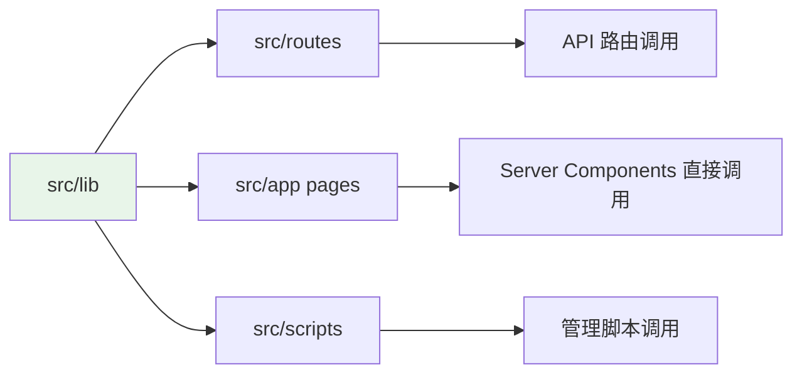

[根目录](../../CLAUDE.md) > **lib (核心业务逻辑层)**

---

# lib - 核心业务逻辑层

> **变更记录 (Changelog)**
> - **2025-11-21 14:31:35**: 初始化模块文档，梳理数据库查询与认证逻辑

---

## 模块职责

`src/lib` 是项目的核心业务逻辑层，负责：
1. **数据库操作**: 使用 Drizzle ORM 进行数据库交互
2. **认证与授权**: JWT 令牌验证与用户会话管理
3. **工具函数**: 通用的辅助函数（如 `cn` 类名合并）

---

## 入口与启动

### 数据库连接入口
- **文件**: `src/lib/db/index.ts`
- **职责**: 初始化 Drizzle ORM 连接，导出 `db` 实例供全局使用

```typescript
// 连接配置
import { drizzle } from "drizzle-orm/mysql2";
import mysql from "mysql2/promise";

const pool = mysql.createPool({
  host: process.env.DATABASE_HOST,
  port: Number(process.env.DATABASE_PORT),
  user: process.env.DATABASE_USERNAME,
  password: process.env.DATABASE_PASSWORD,
  database: process.env.DATABASE_NAME,
});

export const db = drizzle(pool);
```

### 认证入口
- **文件**: `src/lib/auth.ts`
- **关键函数**:
  - `getSession()`: 从 Cookie 中解析 JWT 令牌
  - `getCurrentUser()`: 获取当前登录用户信息

---

## 对外接口

### 数据库查询模块

#### 资源查询 (`src/lib/db/queries/resource.ts`)

**核心函数**:
```typescript
// 获取首页展示资源
getHomeResource(): Promise<Resource[]>

// 分页查询资源列表（支持搜索与分类过滤）
getResourcePageList(
  page: number,
  pageSize: number,
  query?: string,
  category?: string
): Promise<PageResult<Resource>>

// 获取热门资源（带缓存）
getHotResource(): Promise<string[]>

// 保存/更新资源
saveResource(
  id: number | undefined,
  title: string,
  categoryKey: string,
  url: string,
  pinyin: string,
  desc: string,
  diskType: string,
  hotNum: number,
  isShowHome: number | null
): Promise<void>

// 删除资源
deleteResource(id: number): Promise<void>

// 通过拼音获取资源详情（含关联网盘列表）
getResourceByPinyin(name: string): Promise<(Resource & { diskList: ResourceDisk[] }) | null>

// 获取相关推荐资源（智能算法）
getRelatedResources(
  title: string,
  categoryKey?: string,
  excludeId?: number
): Promise<Resource[]>
```

**亮点功能**:
- **智能推荐算法** (`getRelatedResources`):
  - 关键词提取（去除年份、季数、画质等冗余信息）
  - 多维度评分机制：
    - 关键词命中数 +2 分
    - 前缀匹配 +1 分
    - 同分类加权 +2 分
    - 热度微调（hotNum / 1000，最高 +3 分）
  - 同分类优先 + 跨分类补充策略

- **热门资源缓存**:
  - 使用 Next.js `unstable_cache` 缓存 30 分钟
  - 优先从外部 API 获取热门影视数据
  - 降级方案：从数据库按热度排序获取

#### 分类查询 (`src/lib/db/queries/category.ts`)

**核心函数**:
```typescript
// 获取全部分类（不分页）
getCategoryList(): Promise<Category[]>

// 分页查询分类列表（支持名称搜索）
getCategoryPageList(
  page: number,
  pageSize: number,
  name?: string
): Promise<PageResult<Category>>

// 保存/更新分类
saveCategory(
  id: number | undefined,
  name: string,
  key: string
): Promise<void>

// 删除分类
deleteCategory(id: number): Promise<void>
```

#### 用户查询 (`src/lib/db/queries/user.ts`)

**核心函数**:
```typescript
// 通过用户名查找用户
findUserByUsername(username: string): Promise<User | null>

// 通过 ID 查找用户
findUserById(id: number): Promise<User | null>
```

#### 网盘资源查询 (`src/lib/db/queries/resource-disk.ts`)

**核心函数**:
```typescript
// 获取资源对应的网盘列表
getResourceDiskList(resourceId: number): Promise<ResourceDisk[]>

// 保存/更新网盘资源
saveResourceDisk(data: NewResourceDisk): Promise<void>

// 删除网盘资源
deleteResourceDisk(id: number): Promise<void>
```

---

## 关键依赖与配置

### 依赖包
```json
{
  "drizzle-orm": "^0.41.0",      // ORM 框架
  "mysql2": "^3.6.5",            // MySQL 驱动
  "jose": "^6.0.10",             // JWT 验证（Edge Runtime 兼容）
  "jsonwebtoken": "^9.0.2",      // JWT 签名（Node.js Runtime）
  "bcryptjs": "^3.0.2"           // 密码加密
}
```

### 环境变量
```env
# 数据库配置
DATABASE_HOST=your-host
DATABASE_PORT=3306
DATABASE_USERNAME=your-username
DATABASE_PASSWORD=your-password
DATABASE_NAME=your-database

# JWT 密钥
JWT_SECRET=your-secret-key

# 可选：热门资源 API
HOT_MOVIE_API=https://api.example.com/hot
HOT_MOVIE_DAY_API=https://api.example.com/config
```

---

## 数据模型

### Schema 定义 (`src/lib/db/schema.ts`)

**核心表结构**:

```typescript
// 分类表
export const category = mysqlTable("category", {
  id: int("id").autoincrement().primaryKey(),
  name: varchar("name", { length: 255 }).notNull(),
  key: varchar("key", { length: 100 }).notNull().unique(),
});

// 资源表
export const resource = mysqlTable("resource", {
  id: int("id").autoincrement().primaryKey(),
  categoryKey: varchar("category_key", { length: 100 }).notNull(),
  pinyin: varchar("pinyin", { length: 2000 }).notNull().default(""),
  title: varchar("title", { length: 255 }).notNull(),
  desc: text("desc").notNull(),
  cover: varchar("cover", { length: 1000 }).notNull().default(""),
  diskType: varchar("disk_type", { length: 10 }).notNull(),
  url: varchar("url", { length: 1000 }).notNull(),
  hotNum: int("hot_num").notNull().default(0),
  isShowHome: tinyint("is_show_home").default(0),
  updatedAt: datetime("updated_at").default(sql`CURRENT_TIMESTAMP`),
}, (table) => [
  index("idx_hot_num").on(table.hotNum),
  unique("unique_title").on(table.title),
]);

// 用户表
export const user = mysqlTable("user", {
  id: int("id").autoincrement().primaryKey(),
  username: varchar("username", { length: 255 }).notNull(),
  password: varchar("password", { length: 255 }).notNull(),
  createdAt: datetime("created_at").default(sql`CURRENT_TIMESTAMP`),
});

// 资源网盘关联表
export const resourceDisk = mysqlTable("resource_disk", {
  id: int("id").autoincrement().primaryKey(),
  resourceId: int("resource_id").notNull(),
  diskType: varchar("disk_type", { length: 10 }).notNull(),
  externalUrl: varchar("external_url", { length: 1000 }).notNull(),
  url: varchar("url", { length: 1000 }).notNull().default(""),
  updatedAt: datetime("updated_at").default(sql`CURRENT_TIMESTAMP`),
}, (table) => [
  index("idx_resource_id").on(table.resourceId),
]);
```

**类型导出**:
```typescript
export type Category = typeof category.$inferSelect;
export type NewCategory = typeof category.$inferInsert;
export type Resource = typeof resource.$inferSelect;
export type User = typeof user.$inferSelect;
export type ResourceDisk = typeof resourceDisk.$inferSelect;
export type NewResourceDisk = typeof resourceDisk.$inferInsert;
```

---

## 测试与质量

**当前状态**: 无独立测试文件

**推荐测试用例**:
1. **数据库查询测试**:
   - 测试 `getResourcePageList` 的分页逻辑
   - 测试 `getRelatedResources` 的推荐算法准确性
   - 测试搜索功能的模糊匹配

2. **认证逻辑测试**:
   - 测试 JWT 令牌的生成与验证
   - 测试 `getSession` 的边界条件（无 Cookie、过期令牌等）

3. **性能测试**:
   - 测试热门资源缓存命中率
   - 测试大数据量下的查询性能

---

## 常见问题 (FAQ)

### 1. 如何添加新的查询函数？
**步骤**:
1. 在 `src/lib/db/queries/<domain>.ts` 中添加新函数
2. 使用 Drizzle ORM 的链式查询语法
3. 导出函数并在路由或页面中调用

**示例**:
```typescript
// src/lib/db/queries/resource.ts
export async function getTopResources(limit = 10): Promise<Resource[]> {
  return await db
    .select()
    .from(resource)
    .orderBy(desc(resource.hotNum))
    .limit(limit);
}
```

### 2. 如何修改数据表结构？
**步骤**:
1. 修改 `src/lib/db/schema.ts` 中的表定义
2. 运行 `pnpm db:generate` 生成迁移文件
3. 运行 `pnpm db:push` 应用迁移到数据库

**注意**:
- 不要手动编辑 `drizzle/` 下的迁移文件
- 生产环境需谨慎执行迁移（建议先备份数据库）

### 3. JWT 认证失败怎么办？
**排查步骤**:
1. 确认 `.env.local` 中 `JWT_SECRET` 已配置
2. 检查 Cookie 名称是否为 `admin-token`
3. 查看浏览器控制台是否有 CORS 或 Cookie 策略报错
4. 确认 JWT 令牌未过期（默认 24 小时）

### 4. 热门资源 API 不可用怎么办？
**降级方案已内置**:
- 若外部 API 请求失败，会自动从数据库查询热度最高的 10 条资源
- 缓存策略确保频繁请求不会影响性能

---

## 相关文件清单

```
src/lib/
├── db/
│   ├── index.ts                    # 数据库连接入口
│   ├── schema.ts                   # 数据表定义
│   └── queries/
│       ├── resource.ts             # 资源查询逻辑
│       ├── category.ts             # 分类查询逻辑
│       ├── user.ts                 # 用户查询逻辑
│       └── resource-disk.ts        # 网盘资源查询逻辑
├── auth.ts                         # 认证与会话管理
└── utils.ts                        # 工具函数（如 cn 类名合并）
```

---

## 性能优化建议

1. **缓存策略**:
   - 扩展 `unstable_cache` 使用范围（如分类列表、首页资源）
   - 考虑引入 Redis 缓存热门搜索关键词

2. **查询优化**:
   - 监控慢查询日志，优化索引使用
   - 对于高频查询（如首页资源），使用数据库读写分离

3. **连接池管理**:
   - 调整 `mysql2` 连接池大小（默认 10）
   - 监控连接池使用率，避免连接泄漏

---

## 与其他模块的关系



**调用关系**:
- **被调用**: API 路由 (`src/routes`)、页面组件 (`src/app`)、运维脚本 (`src/scripts`)
- **依赖**: 数据库连接（MySQL）、环境变量

---

## 下一步优化方向

1. 添加查询函数的单元测试（使用 Vitest）
2. 实现数据库查询的日志记录与监控
3. 优化 `getRelatedResources` 算法（引入 TF-IDF 或向量相似度）
4. 添加数据库事务支持（如批量更新资源时）
5. 实现软删除功能（添加 `deletedAt` 字段）
