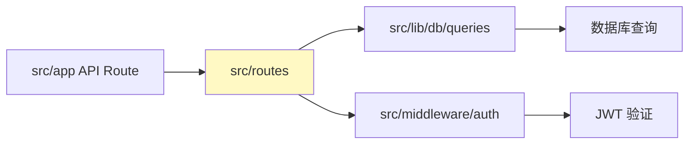

[根目录](../../CLAUDE.md) > **routes (API 路由层)**

---

# routes - API 路由层

> **变更记录 (Changelog)**
> - **2025-11-21 14:31:35**: 初始化模块文档，梳理 API 端点与认证逻辑

---

## 模块职责

`src/routes` 是项目的 API 路由定义层，基于 **Hono 框架**实现：
1. **RESTful API 设计**: 提供资源、分类、用户、网盘资源的 CRUD 接口
2. **请求验证**: 使用 Zod 进行参数校验
3. **认证保护**: 集成 JWT 中间件，保护管理后台 API

---

## 入口与启动

### 主路由入口
- **文件**: `src/app/api/[[...route]]/route.ts`
- **职责**: 聚合所有子路由，暴露 HTTP 方法处理器

```typescript
import { Hono } from "hono";
import { handle } from "hono/vercel";
import resource from "@/routes/resource";
import category from "@/routes/category";
import user from "@/routes/user";
import resourceDisk from "@/routes/resource-disk";

const app = new Hono().basePath("/api");

// 注册子路由
app.route("/category", category);
app.route("/resource", resource);
app.route("/resource-disk", resourceDisk);
app.route("/user", user);

// 导出 Next.js API 处理器
export const GET = handle(app);
export const POST = handle(app);
export const PUT = handle(app);
export const DELETE = handle(app);
```

### 子路由结构
```
/api
├── /category       # 分类管理（需认证）
├── /resource       # 资源管理（需认证）
├── /resource-disk  # 网盘资源管理（需认证）
└── /user           # 用户登录（无需认证）
```

---

## 对外接口

### 1. 资源管理 API (`/api/resource`)

**文件**: `src/routes/resource.ts`

#### 端点列表

| 方法 | 路径 | 描述 | 认证 |
|------|------|------|------|
| GET | `/api/resource/list` | 分页查询资源列表（支持搜索与分类过滤） | 需要 |
| POST | `/api/resource/save` | 创建/更新资源 | 需要 |
| POST | `/api/resource/delete` | 删除资源 | 需要 |

#### 请求参数示例

**GET `/api/resource/list`**:
```typescript
{
  page?: number;       // 页码（默认 1）
  pageSize?: number;   // 每页数量（默认 10）
  title?: string;      // 标题搜索（模糊匹配）
  category?: string;   // 分类 key 过滤
}
```

**POST `/api/resource/save`**:
```typescript
{
  id?: number;         // 资源 ID（更新时提供）
  title: string;       // 资源标题
  categoryKey: string; // 分类 key
  url: string;         // 资源链接
  pinyin: string;      // 拼音（SEO 友好 URL）
  desc: string;        // 资源描述
  diskType: string;    // 网盘类型（baidu/quark/ali）
  hotNum: number;      // 热度值
  isShowHome?: number; // 是否首页展示（0/1）
}
```

**POST `/api/resource/delete`**:
```typescript
{
  id: number;          // 资源 ID
}
```

#### 响应示例

**成功响应** (200):
```json
{
  "list": [
    {
      "id": 1,
      "title": "这就是街舞 第三季",
      "categoryKey": "zongyi",
      "pinyin": "zhe-jiu-shi-jie-wu-di-san-ji",
      "desc": "街舞真人秀节目",
      "cover": "https://example.com/cover.jpg",
      "diskType": "quark",
      "url": "https://pan.quark.cn/...",
      "hotNum": 1500,
      "isShowHome": 1,
      "updatedAt": "2025-11-21T14:00:00.000Z"
    }
  ],
  "total": 100
}
```

**错误响应** (401):
```json
{
  "error": "未授权，请先登录"
}
```

---

### 2. 分类管理 API (`/api/category`)

**文件**: `src/routes/category.ts`

#### 端点列表

| 方法 | 路径 | 描述 | 认证 |
|------|------|------|------|
| GET | `/api/category/all` | 获取全部分类（不分页） | 需要 |
| GET | `/api/category/list` | 分页查询分类列表 | 需要 |
| POST | `/api/category/save` | 创建/更新分类 | 需要 |
| POST | `/api/category/delete` | 删除分类 | 需要 |

#### 请求参数示例

**GET `/api/category/list`**:
```typescript
{
  page?: number;       // 页码（默认 1）
  pageSize?: number;   // 每页数量（默认 10）
  name?: string;       // 名称搜索（模糊匹配）
}
```

**POST `/api/category/save`**:
```typescript
{
  id?: number;         // 分类 ID（更新时提供）
  name: string;        // 分类名称
  key: string;         // 分类唯一标识（用于 URL）
}
```

---

### 3. 用户登录 API (`/api/user`)

**文件**: `src/routes/user.ts`

#### 端点列表

| 方法 | 路径 | 描述 | 认证 |
|------|------|------|------|
| POST | `/api/user/login` | 管理员登录 | 无需 |

#### 请求参数示例

**POST `/api/user/login`**:
```typescript
{
  username: string;    // 用户名
  password: string;    // 明文密码
}
```

#### 响应示例

**成功响应** (200):
```json
{
  "id": 1,
  "username": "admin@qq.com"
}
```

**注意**: 登录成功后会自动设置 `admin-token` Cookie（24 小时有效期）

**错误响应** (401):
```json
{
  "error": "用户或密码错误"
}
```

---

### 4. 网盘资源管理 API (`/api/resource-disk`)

**文件**: `src/routes/resource-disk.ts`

#### 端点列表

| 方法 | 路径 | 描述 | 认证 |
|------|------|------|------|
| GET | `/api/resource-disk/list` | 查询资源对应的网盘列表 | 需要 |
| POST | `/api/resource-disk/save` | 创建/更新网盘资源 | 需要 |
| POST | `/api/resource-disk/delete` | 删除网盘资源 | 需要 |

---

## 关键依赖与配置

### 依赖包
```json
{
  "hono": "^4.7.5",               // Web 框架
  "@hono/zod-validator": "^0.4.3", // Zod 验证中间件
  "zod": "^3.24.2",               // Schema 验证
  "jsonwebtoken": "^9.0.2",       // JWT 签名
  "bcryptjs": "^3.0.2"            // 密码加密
}
```

### 中间件配置

**认证中间件** (`src/middleware/auth.ts`):
```typescript
import { getCookie } from "hono/cookie";
import jwt from "jsonwebtoken";

export const authMiddleware = async (c, next) => {
  const token = getCookie(c, "admin-token");

  if (!token) {
    return c.json({ error: "未授权" }, 401);
  }

  try {
    const decoded = jwt.verify(token, process.env.JWT_SECRET || "secret");
    c.set("user", decoded);
    await next();
  } catch (error) {
    return c.json({ error: "令牌无效" }, 401);
  }
};
```

**应用中间件**:
```typescript
// src/routes/resource.ts
const app = new Hono().use("*", authMiddleware);
```

---

## 数据验证

### Zod Schema 定义示例

**资源保存验证**:
```typescript
const saveSchema = z.object({
  id: z.coerce.number().optional(),
  title: z.string(),
  categoryKey: z.string(),
  url: z.string(),
  pinyin: z.string(),
  desc: z.string(),
  diskType: z.string(),
  hotNum: z.coerce.number(),
  isShowHome: z.coerce.number().optional().default(0),
});
```

**使用方式**:
```typescript
app.post("/save", zValidator("json", saveSchema), async (c) => {
  const data = c.req.valid("json"); // 已验证的数据
  // ...业务逻辑
});
```

---

## 测试与质量

**当前状态**: 无独立测试文件

**推荐测试用例**:
1. **API 端点测试**:
   - 测试所有端点的请求参数验证
   - 测试认证中间件的边界条件
   - 测试错误响应格式

2. **集成测试**:
   - 测试完整的资源 CRUD 流程
   - 测试登录后的会话保持
   - 测试并发请求的数据一致性

**建议工具**:
- API 测试: Supertest + Vitest
- Mock 数据库: 使用 Vitest 的 `vi.mock`

---

## 常见问题 (FAQ)

### 1. 如何添加新的 API 端点？
**步骤**:
1. 在 `src/routes` 下创建新文件（如 `src/routes/comment.ts`）
2. 定义 Hono 实例并添加路由
3. 在 `src/app/api/[[...route]]/route.ts` 中注册新路由

**示例**:
```typescript
// src/routes/comment.ts
import { Hono } from "hono";

const app = new Hono();

app.get("/list", async (c) => {
  return c.json({ comments: [] });
});

export default app;

// src/app/api/[[...route]]/route.ts
import comment from "@/routes/comment";
app.route("/comment", comment);
```

### 2. 如何调试 API 请求？
**方法**:
1. 使用浏览器开发者工具的 Network 面板
2. 使用 Postman 或 Thunder Client（VS Code 插件）
3. 在路由处理器中添加 `console.log` 打印请求数据

**示例**:
```typescript
app.post("/save", async (c) => {
  const body = await c.req.json();
  console.log("收到请求:", body);
  // ...
});
```

### 3. 认证失败怎么办？
**排查步骤**:
1. 确认 Cookie 中存在 `admin-token`（浏览器开发者工具 → Application → Cookies）
2. 确认 JWT_SECRET 环境变量已配置
3. 检查令牌是否过期（默认 24 小时）
4. 查看服务器日志中的错误信息

### 4. CORS 跨域问题怎么处理？
**解决方案**:
```typescript
// src/app/api/[[...route]]/route.ts
import { cors } from "hono/cors";

const app = new Hono().basePath("/api");

app.use("*", cors({
  origin: ["http://localhost:3000", "https://pansousuo.top"],
  credentials: true,
}));
```

---

## 相关文件清单

```
src/routes/
├── resource.ts          # 资源管理 API
├── category.ts          # 分类管理 API
├── user.ts              # 用户登录 API
└── resource-disk.ts     # 网盘资源管理 API

src/middleware/
└── auth.ts              # JWT 认证中间件

src/app/api/[[...route]]/
└── route.ts             # 主路由入口
```

---

## 性能优化建议

1. **请求限流**:
   - 添加 Rate Limiting 中间件（防止暴力破解登录）
   - 示例: `hono-rate-limiter`

2. **响应压缩**:
   - 使用 Hono 的 `compress` 中间件压缩 JSON 响应

3. **缓存策略**:
   - 对于不常变动的数据（如分类列表），添加 `Cache-Control` 头
   - 示例: `c.header("Cache-Control", "public, max-age=300")`

4. **异步日志**:
   - 使用异步日志库记录 API 请求（如 `pino`）

---

## 与其他模块的关系



**依赖关系**:
- **调用**: `src/lib/db/queries/*` (数据库查询)
- **被调用**: Next.js API Routes (`src/app/api`)
- **中间件**: `src/middleware/auth.ts`

---

## 下一步优化方向

1. 添加 API 端点的单元测试与集成测试
2. 实现 API 日志记录（请求耗时、错误追踪）
3. 添加 OpenAPI/Swagger 文档生成
4. 实现 API 版本管理（如 `/api/v1/resource`）
5. 添加 GraphQL 支持（可选）
